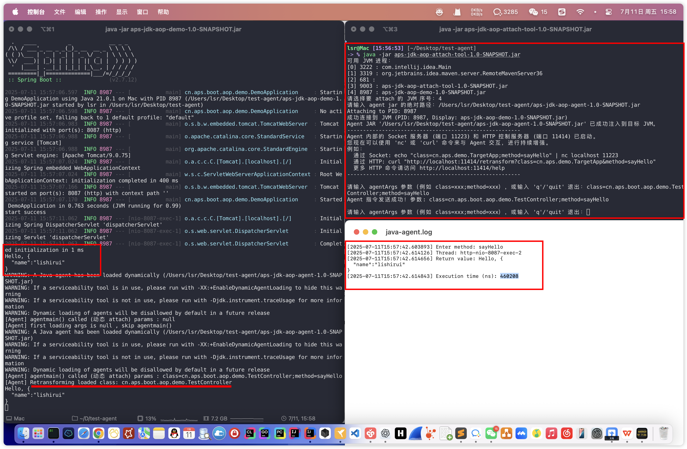
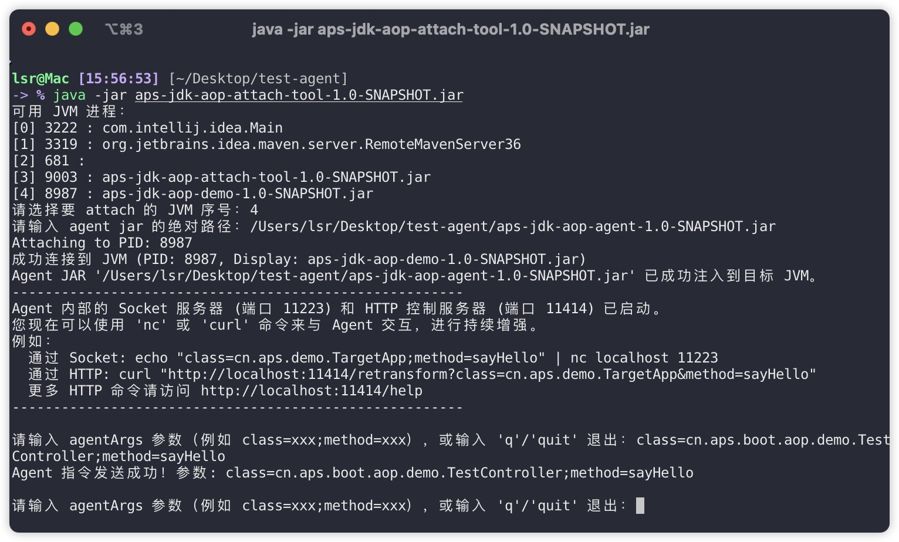
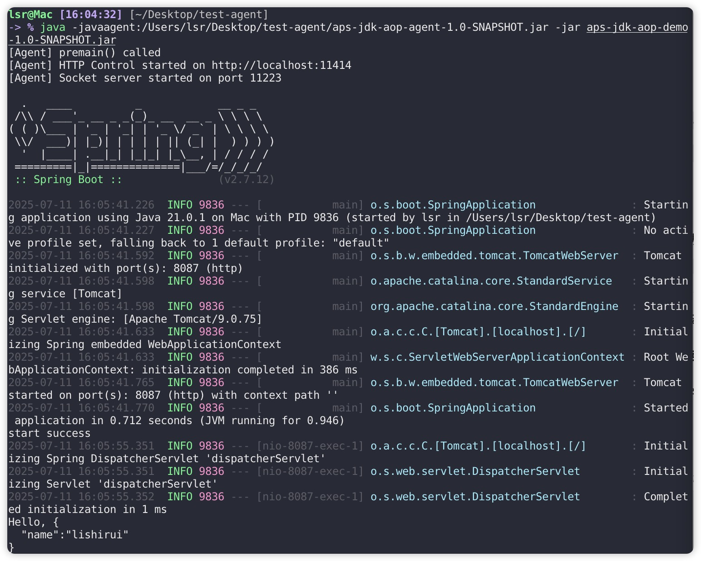
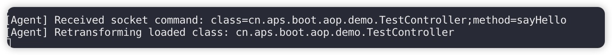
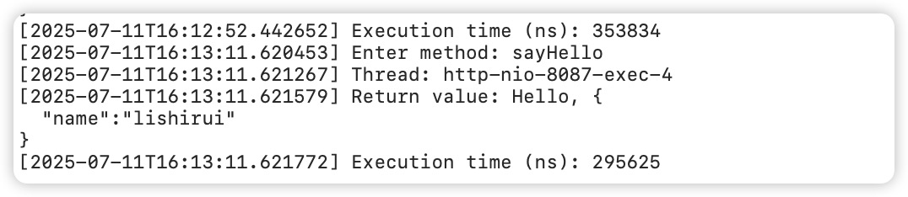
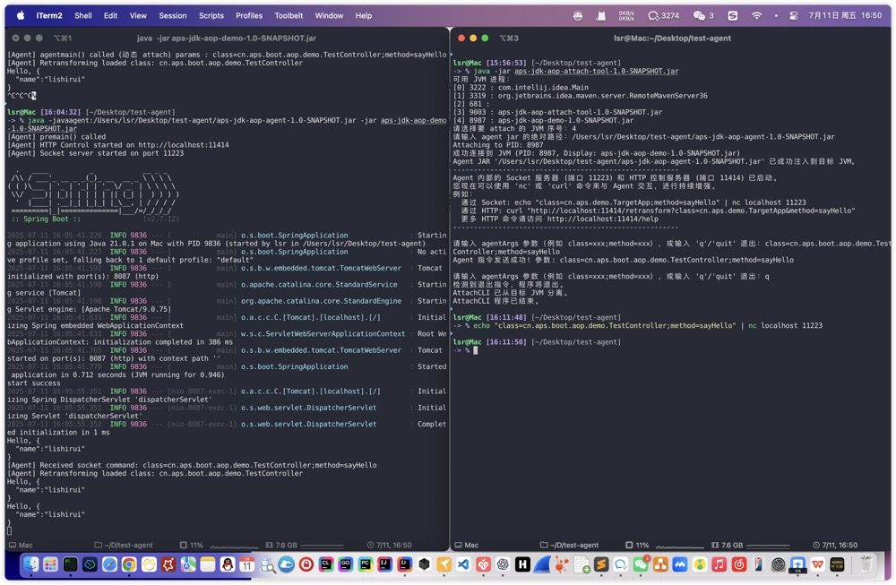

# 工程结构说明
    <module>aps-jdk-aop-demo</module> 测试用例
    <module>aps-jdk-aop-agent</module> 加载到jvm的agent
    <module>aps-jdk-aop-attach-tool</module> 通过attach连接jvm，加载agent，实现aop功能

# 效果预览

# 方式1：通过attach连接jvm，加载agent，实现aop功能
    java -jar aps-jdk-aop-attach-tool-1.0-SNAPSHOT.jar
    根据命令提示进行输入
    1、进程号
    2、agent路径
    3、增强的类和方法等信息 如 class=cn.aps.boot.aop.demo.TestController;method=sayHello

# 方式2：通过启动参数指定
    java -javaagent:aps-jdk-aop-agent-1.0-SNAPSHOT.jar -jar aps-jdk-aop-demo-1.0-SNAPSHOT.jar

    
    通过命令的方式进行访问增强，内置了socket端口 11223 ，http端口 11414
    socket 增强类命令：
    echo "class=cn.aps.boot.aop.demo.TestController;method=sayHello" | nc localhost 11223

    
    重新请求已经增强类：
    查看agent日志

# 效果图

    Http 增强类命令：
    # 增强某方法
    curl "http://localhost:11414/retransform?class=cn.aps.demo.TargetApp&method=sayHello&desc=(Ljava/lang/String;)Ljava/lang/String;"
    # 查看已加载类
    curl http://localhost:11414/list
    # 查看日志
    curl http://localhost:11414/log
    # 卸载增强
    curl http://localhost:11414/remove
    # 帮助菜单
    curl http://localhost:11414/help